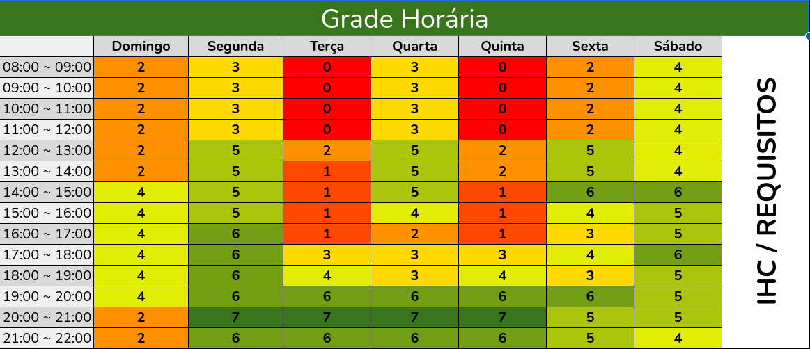

## Heatmap de Disponibilidade

Para simplificar a organização de encontros e assegurar a contribuição eficaz de cada integrante da equipe, o heatmap visa identificar os períodos mais convenientes para todos os membros. Ao reunir esses dados, será possível elaborar um cronograma de reuniões que respeite as limitações de horário de cada pessoa, fomentando a envolvimento ativo de todos.

A identificação dos horários em que os membros da equipe estão livres foi realizada por meio de um mapa de calor. Cada integrante da equipe preencheu uma tabela com os horários em que está disponível para reuniões. Em seguida, os dados foram compilados em um mapa de calor onde o número mais baixo indica que os integrantes não estão disponíveis naquele horário e o número mais alto indica que a maioria ou o grupo em sua totalidade está disponível.

### Imagem do Heatmap

### Resultados da Análise de Disponibilidade

Com base na avaliação do Heatmap, identificamos os seguintes horários como os mais adequados para as reuniões do Grupo 3:

- **Segunda-feira**: 20:00 - 21:00
- **Terça-feira**: 20:00 - 21:00
- **Quarta-feira**: 20:00 - 21:00
- **Quinta-feira**: 20:00 - 21:00

Após uma votação entre os membros, ficou estabelecido que:

- As reuniões de planejamento (Plannings) ocorrerão às **segundas-feiras**, das **20:00 às 21:00**.
- As reuniões de atualização de revisão (Review) serão realizadas às **quintas-feiras**, também das **20:00 às 21:00**.

### Histórico de Versões

| Versão | Data       | Descrição            | Autor | Revisor |
|--------|------------|----------------------|-----------------------------------|--------------------------------------|
| 0.1    | 11/09/2023 | Planejamento Heat Map       | [Caio Lelis](https://github.com/caio-lelis) | [Caio Braga](https://github.com/caioalvesbraga) |
   
