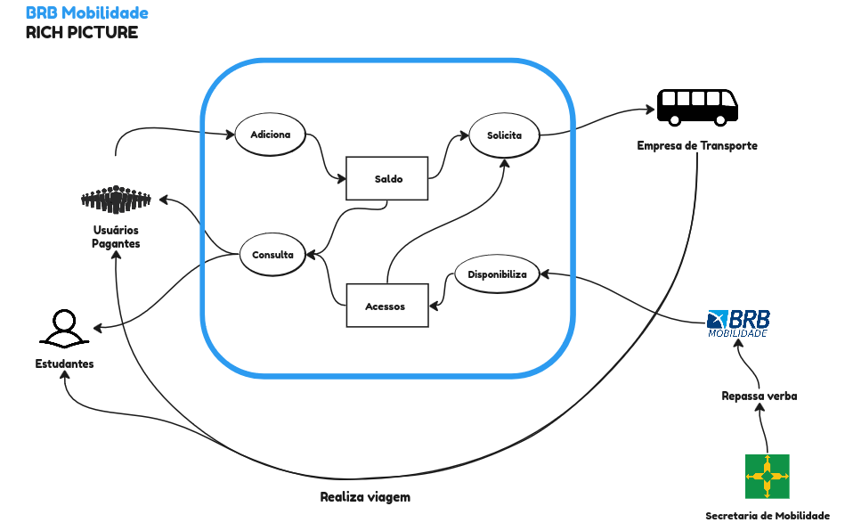
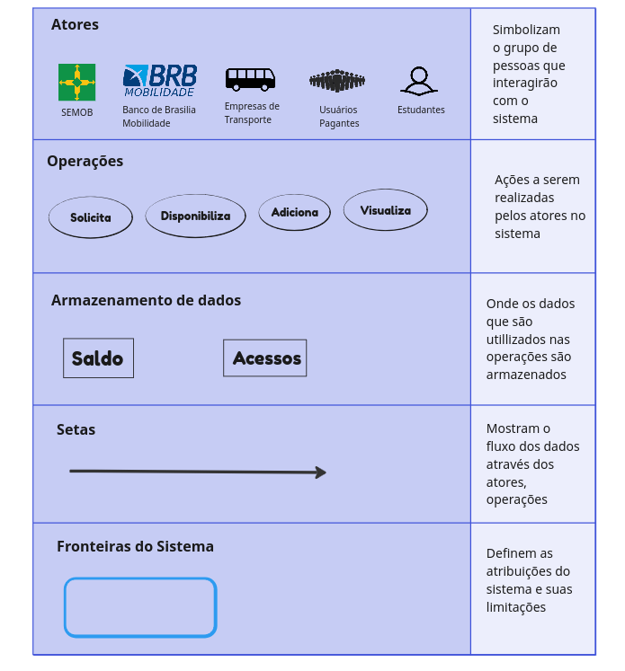

# Rich Picture

Um Rich Picture (imagem rica, em tradução livre) é uma representação visual, muitas vezes desenhada à mão, que captura de forma abstrata e multifacetada um sistema complexo, situação ou problema. Geralmente utilizado em contextos de análise de sistemas, gerenciamento de projetos e resolução de problemas, um Rich Picture incorpora elementos gráficos, símbolos e anotações para mostrar as interações entre pessoas, processos, tecnologias e fatores ambientais. Ele ajuda a esclarecer a compreensão de um sistema complexo e serve como uma ferramenta de comunicação para envolver partes interessadas na análise e solução de problemas.

 

### Diagrama

    
 Figura 1: Rich Picture do BRB Mobilidade.Fonte: Caio Braga

 

### **Componentes do Rich Picture**

Encontra-se acima uma breve explicação sobre os principais componentes que estruturam o Rich Picture, para facilitar no entendimento.
  

 Figura 1: Componentes do Rich Picture do BRB Mobilidade.Fonte: Caio Braga

  

### **Histórico de versão**

| Versão |          Descrição              |     Autor      |      Data      |   Revisor     |    Data de revisão    |  
|:------:|:-------------------------------:|:--------------:|:--------------:|:-------------:|:---------------------:|
|  1.1   | Versão inicial                        | Caio Lelis   | 10/09/2023   | Doan Filho   | 12/09/2023  |
|  1.2   | Adição do Rich Picture                | Caio Braga   | 19/09/2023   | Doan Filho   | 20/09/2023  |
|  1.3   | Adicionando nova versão rich picture  | Caio Braga   | 05/09/2023   | Doan Filho   | 05/09/2023  |
