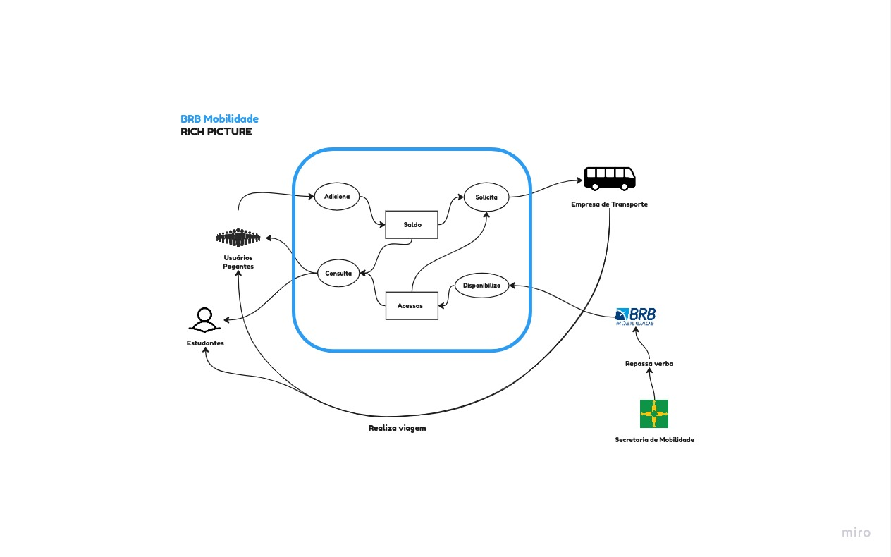
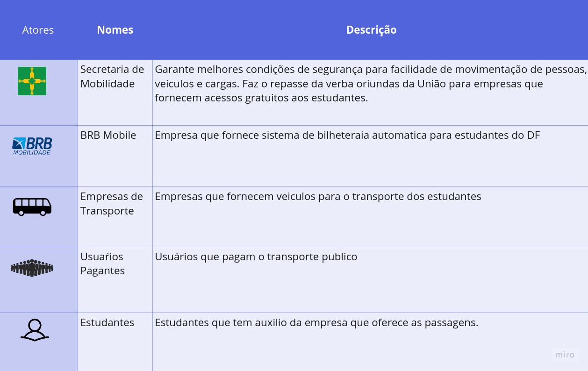

# Rich Picture

Um Rich Picture (imagem rica, em tradução livre) é uma representação visual, muitas vezes desenhada à mão, que captura de forma abstrata e multifacetada um sistema complexo, situação ou problema. Geralmente utilizado em contextos de análise de sistemas, gerenciamento de projetos e resolução de problemas, um Rich Picture incorpora elementos gráficos, símbolos e anotações para mostrar as interações entre pessoas, processos, tecnologias e fatores ambientais. Ele ajuda a esclarecer a compreensão de um sistema complexo e serve como uma ferramenta de comunicação para envolver partes interessadas na análise e solução de problemas.

## **Rich Picture do BRB Mobilidade**

Esse é o Rich Picture que representa os atores, armazenamento, fluxos, funcionalidades e limites do sistema do BRB Mobilidade

## **Componentes do Rich Picture**

Esses são os componentes mais representativos do nosso Rich Picture.

## **Descrição de Rich Picture**

Encontra-se acima uma breve explicação sobre os principais componentes que estruturam o Rich Picture, para facilitar no entendimento.

| Versão | Data       | Descrição            | Autor | Revisor |
|--------|------------|----------------------|-----------------------------------|--------------------------------------|
| 1.0    | 19/09/2023 | Adição do Rich Picture     |  [Caio Braga](https://github.com/caioalvesbraga) |[Doan Filho](https://github.com/FilhoDoan)|