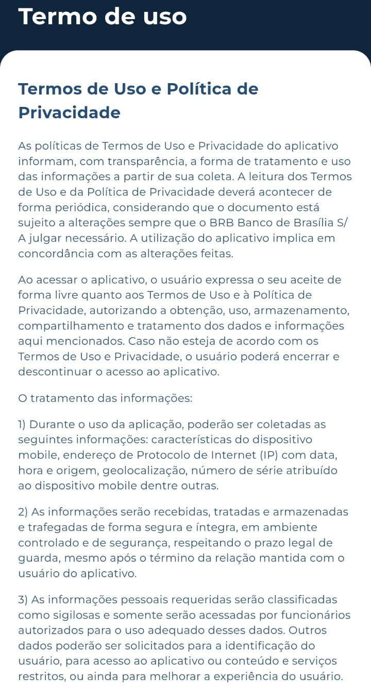
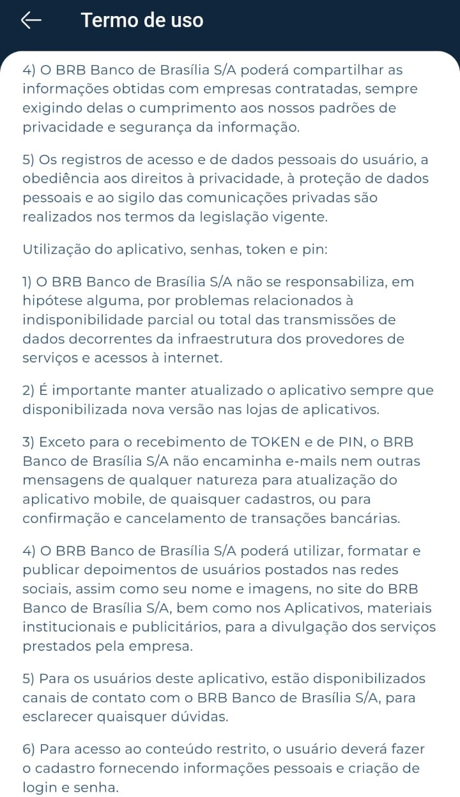
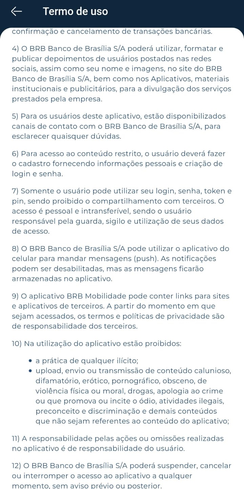

# **Termos de Uso**

Nesta seção, você encontrará informações detalhadas sobre o planejamento do nosso projeto. Isso inclui o heatmap de disponibilidade dos integrantes, o aplicativo selecionado, os termos de uso do aplicativo, as ferramentas do projeto, um cronograma detalhado e o rich picture.
# **Termos de Uso - BRB Mobilidade**
## **Introdução**

Esse documento tem como objetivo documentar os termos de uso da aplicação BRB Mobilidade, escolhida para estudo e planejamento do projeto.

## **Termos de Uso e Política de Privacidade**

## **Conclusão**

A equipe responsável pelo planejamento do projeto garante que foi lido e que serão seguidos todos os termos de uso durante seu desenvolvimento, mantendo a conformidade com as políticas estabelecidas pela empresa.

## **Fonte**

<a id="aa" href="#a">[1]</a> BRB Mobilidade. Disponível em sua aplicação Mobile. Acesso em: 18 de setembro de 2023.

#### **Histórico de Versões**

| Versão |          Descrição              |     Autor      |      Data      |   Revisor     |    Data de revisão    |  
|:------:|:-------------------------------:|:--------------:|:--------------:|:-------------:|:---------------------:|
|  1.0   | Criação do documento e adição dos termos de uso  | Joel Soares    | 18/09/2023   | Guilherme basilio   | 19/09/2023     |
|  1.1   | Refatoração dos termos de uso, adição de imagens | Joels Soares   | 28/09/2023   | Guilherme Basilio   | 29/09/2023     |

